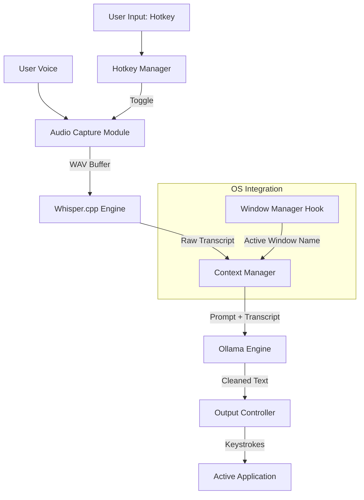

# Technical Architecture

This document outlines the system architecture for the offline, privacy-first dictation tool.

## 1. High-Level Architecture Diagram

## 2. Core Components

### A. Input Handling & Audio Capture
- **Hotkey Manager:** Uses the `keyboard` Python library to establish a global hook that listens for the toggle combination without interfering with normal typing.
- **Audio Capture Module:** Uses `sounddevice` to record audio at 16kHz directly into a numpy array / RAM buffer to avoid disk I/O latency.

### B. OS Integration
- **Window Manager Hook:** Uses `win32gui` and `psutil` (on Windows) to fetch the executable name of the currently focused window (e.g., `idea64.exe`).
- **Output Controller:** Uses `pyautogui` or `pynput` to simulate natural, rapid keystrokes to type the final output into the focused window.

### C. AI Processing Pipeline (100% Local)
- **Transcription (STT):** 
  - **Tool:** `whisper.cpp` (via python bindings).
  - **Why:** Highly optimized for CPU and Apple Silicon, allowing fast inference without requiring massive Nvidia GPUs.
- **Post-Processing (LLM):**
  - **Tool:** `Ollama` running locally as a background service.
  - **Why:** Ollama provides a simple local API to run models like Llama-3 (8B) or Phi-3 (3B). It handles memory management and GPU offloading automatically.

## 3. Data Flow Execution
1. User presses `Ctrl+Space`. Hotkey Manager signals Audio Capture to start.
2. User speaks.
3. User presses `Ctrl+Space`. Audio Capture stops and passes the audio buffer to Whisper.
4. Whisper returns the raw, unformatted transcript.
5. Context Manager queries the OS for the active window name.
6. Context Manager selects the corresponding system prompt (e.g., if window is `slack.exe`, prompt is "casual").
7. The system prompt and raw transcript are sent to the local Ollama API.
8. Ollama returns the cleaned, formatted text.
9. Output Controller types the text into the active window.
